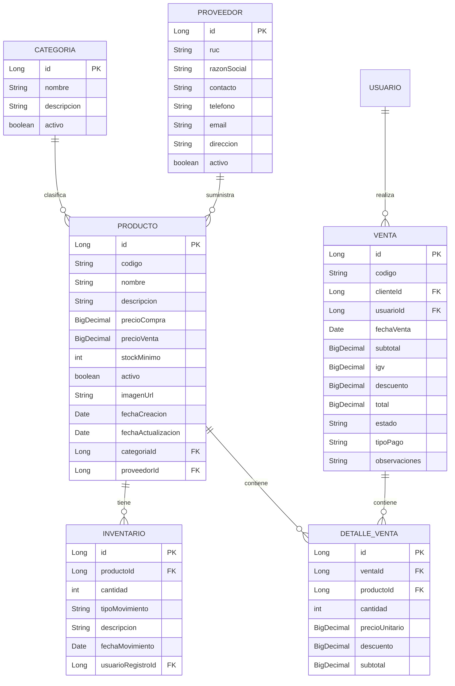
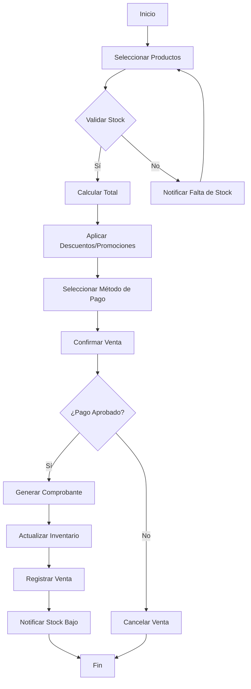

# Módulo de Gestión de Inventario - Gym Management System

## 1. Introducción

Este documento describe el diseño e implementación del módulo de gestión de inventario para el sistema de gestión de gimnasio. El módulo permitirá gestionar productos, suplementos, control de stock y ventas de manera eficiente.

## 2. Diagrama de Entidad-Relación



## 3. Diagrama de Flujo - Proceso de Venta



## 4. Estructura de Paquetes

```
com.gymmanagement.gym_app
├── config
├── controller
│   └── inventory
│       ├── ProductoController.java
│       ├── CategoriaController.java
│       ├── ProveedorController.java
│       └── VentaController.java
├── domain
│   ├── inventory
│   │   ├── Producto.java
│   │   ├── Categoria.java
│   │   ├── Proveedor.java
│   │   ├── Inventario.java
│   │   ├── Venta.java
│   │   └── DetalleVenta.java
│   └── enums
│       ├── TipoMovimientoInventario.java
│       ├── EstadoVenta.java
│       └── TipoPago.java
├── dto
│   └── inventory
│       ├── ProductoDTO.java
│       ├── VentaDTO.java
│       └── requests
│           ├── VentaRequest.java
│           └── MovimientoInventarioRequest.java
├── repository
│   └── inventory
│       ├── ProductoRepository.java
│       ├── CategoriaRepository.java
│       ├── ProveedorRepository.java
│       ├── InventarioRepository.java
│       └── VentaRepository.java
├── service
│   ├── inventory
│   │   ├── ProductoService.java
│   │   ├── InventarioService.java
│   │   └── VentaService.java
│   └── impl
│       └── inventory
│           ├── ProductoServiceImpl.java
│           ├── InventarioServiceImpl.java
│           └── VentaServiceImpl.java
└── util
    └── exceptions
        └── InventoryException.java
```

## 5. Casos de Uso Principales

### 5.1 Gestión de Productos
- Registrar nuevo producto con sus características
- Actualizar información de productos existentes
- Dar de baja productos (baja lógica)
- Consultar productos por diferentes criterios (categoría, proveedor, stock bajo)
- Gestionar imágenes de productos

### 5.2 Control de Inventario
- Registrar entradas y salidas de productos
- Ajustes de inventario (conteos físicos)
- Alertas de stock mínimo
- Historial de movimientos de inventario
- Reporte de inventario actual

### 5.3 Gestión de Proveedores
- Mantenimiento de información de proveedores
- Historial de compras por proveedor
- Evaluación de proveedores

### 5.4 Proceso de Ventas
- Registro de ventas al contado
- Registro de ventas a crédito
- Anulación de ventas
- Generación de comprobantes
- Reportes de ventas

## 6. Reglas de Negocio

1. **Validación de Stock**: No se pueden vender productos con stock insuficiente
2. **Precios**: El precio de venta no puede ser menor al precio de compra
3. **Descuentos**: Los descuentos no pueden superar el 30% del valor del producto
4. **Stock Mínimo**: Alerta cuando el stock está por debajo del mínimo configurado
5. **Trazabilidad**: Todo movimiento de inventario debe quedar registrado con usuario y fecha

## 7. Seguridad

- Solo usuarios con rol ADMIN o INVENTORY pueden gestionar productos e inventario
- Solo usuarios con rol CAJERO o superior pueden registrar ventas
- Todas las operaciones deben quedar auditadas

## 8. Integraciones

1. **Sistema de Puntos**: Acumulación de puntos por compras
2. **Módulo de Miembros**: Descuentos especiales para miembros
3. **Módulo de Contabilidad**: Registro automático de ingresos

## 9. Mejoras Futuras

1. Integración con lectores de código de barras
2. App móvil para consulta de inventario
3. Dashboard analítico de ventas e inventario
4. Sistema de compras a proveedores
5. Integración con impresoras fiscales
