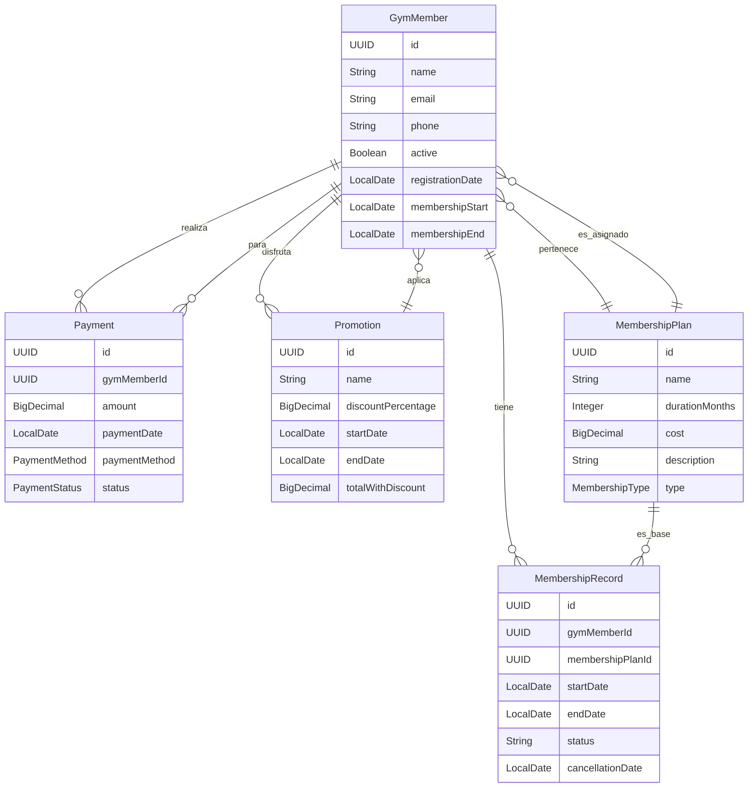
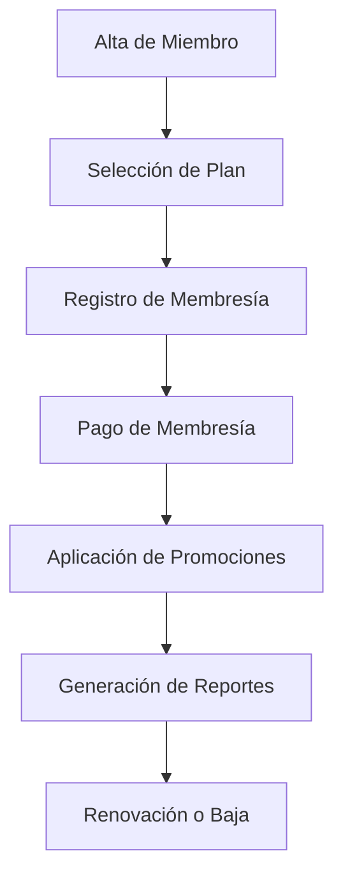
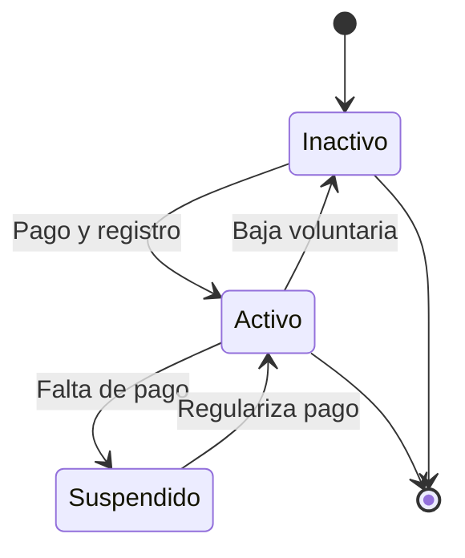
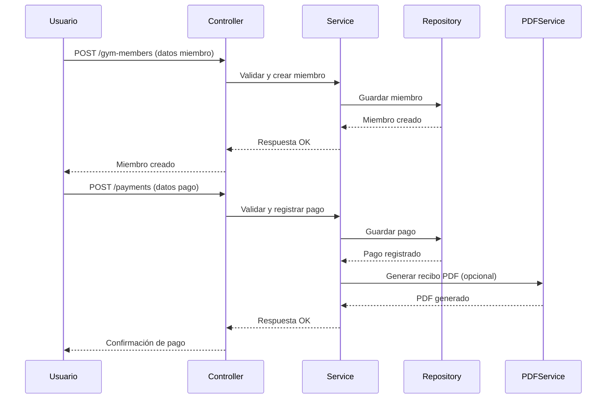

# Análisis y Diseño del Sistema - Gym Management API

## 1. Arquitectura General

La aplicación implementa una arquitectura híbrida denominada **Arquitectura Multicapa Orientada a Servicios con Patrón MVC**. Este enfoque combina los beneficios del patrón **MVC (Modelo-Vista-Controlador)** y la **arquitectura en n-capas**, resultando en una solución robusta, escalable y profesional.

### Estructura de Carpetas y Capas del Proyecto

- **controller/**: Capa de controladores REST. Gestiona las solicitudes HTTP y aplica el patrón Controller de MVC.
- **service/**: Capa de servicios. Contiene la lógica de negocio y orquesta operaciones entre entidades y repositorios.
- **model/**: Modelos de datos y DTOs. Representan entidades del dominio y estructuras de intercambio de datos.
- **repository/**: Capa de acceso a datos. Gestiona la persistencia y recuperación de información desde la base de datos.
- **domain/**: Entidades, enums y lógica de dominio puro.
- **mapper/**: Conversión entre entidades y DTOs, promoviendo separación y desacoplamiento.
- **config/**: Configuración global (OpenAPI, versionado, seguridad, etc.).
- **exception/**: Manejo centralizado de errores y excepciones.
- **utils/** y **validation/**: Utilidades y validadores reutilizables.

### Conclusión Profesional

Este diseño se conoce como **Arquitectura Multicapa Orientada a Servicios con MVC**. Es ideal para sistemas empresariales modernos porque:
- Permite una clara separación de responsabilidades.
- Facilita el mantenimiento, pruebas y escalabilidad.
- Promueve el bajo acoplamiento y alta cohesión entre capas.
- Está alineado con los estándares de la industria para aplicaciones Java Spring Boot.

Arquitectura multicapa moderna, combinando principios de MVC, DDD (Domain-Driven Design) y SOA (Service-Oriented Architecture), implementados sobre Spring Boot.

## 2. Modelo de Datos (Entidades y Relaciones)



## 3. Diagrama de Flujo Principal



## 4. Diagrama de Estados (Miembro)



## 5. Descripción de Entidades

### GymMember
- Datos personales y estado de membresía.
- Relacionado a pagos, promociones y planes.

### MembershipPlan
- Define duración, costo, descripción y tipo.

### MembershipRecord
- Historial de membresías, fechas y estado.

### Promotion
- Descuentos aplicados a miembros.

### Payment
- Pagos realizados por miembros, método y estado.

## 6. Flujo de Procesos
- Alta de miembro → Selección de plan → Registro de membresía → Pago → Aplicación de promoción (opcional) → Reportes.
- Renovación y bajas gestionadas por registros y pagos.

## 7. Patrones y Buenas Prácticas
- Separación de capas (Controller, Service, Model).
- Uso de DTOs para exponer datos.
- Validaciones con anotaciones.
- Documentación con Swagger/OpenAPI.

## 8. Estados Clave
- Miembro: Activo, Inactivo, Suspendido.
- Pago: Pendiente, Completado, Fallido.
- Membresía: Activa, Cancelada, Expirada.

## 9. Casos de Uso Actuales

| Caso de Uso                        | Descripción                                                                                 |
|------------------------------------|---------------------------------------------------------------------------------------------|
| Gestión de Miembros                | Alta, consulta, actualización y baja de miembros del gimnasio.                              |
| Gestión de Planes de Membresía     | Creación, consulta, actualización y eliminación de planes.                                  |
| Gestión de Registros de Membresía  | Registro histórico de membresías activas, renovadas o canceladas.                           |
| Gestión de Pagos                   | Registro y consulta de pagos realizados por los miembros.                                   |
| Gestión de Promociones             | Aplicación y consulta de promociones vigentes para miembros.                                |
| Generación de Reportes             | Reportes de retención, membresías activas/inactivas y métricas clave.                       |
| Generación de PDFs                 | Descarga de reportes y fichas de miembros en formato PDF.                                   |

## 10. Casos de Uso Futuros Potenciales

| Caso de Uso                        | Descripción                                                                                 |
|------------------------------------|---------------------------------------------------------------------------------------------|
| Autenticación y Roles              | Control de acceso por perfiles (admin, staff, cliente).                                     |
| Notificaciones Automatizadas       | Envío de recordatorios de pago y promociones por email/SMS.                                 |
| Dashboard Analítico                | Visualización gráfica de métricas de negocio y retención.                                   |
| Integración con Apps de Fitness    | Sincronización de datos con aplicaciones externas (ej: Fitbit, Google Fit).                 |
| Gestión de Clases y Horarios       | Reservas, control de asistencia y calendario de clases.                                     |
| Pagos en Línea                     | Integración con pasarelas de pago y cobros automáticos.                                     |
| Soporte Multisucursal              | Administración centralizada de múltiples sedes.                                             |
| Historial de Cambios y Auditoría   | Registro detallado de todas las operaciones y cambios en el sistema.                        |
| Soporte Multilenguaje              | Interfaz y reportes en varios idiomas para expansión internacional.                         |

## 11. Diagrama de Casos de Uso (Actuales y Futuros)

```mermaid
%% Diagrama de casos de uso simplificado para Gym Management
usecaseDiagram
  actor Admin
  actor Staff
  actor Miembro

  Admin -- (Gestionar Miembros)
  Admin -- (Gestionar Planes de Membresía)
  Admin -- (Gestionar Registros de Membresía)
  Admin -- (Gestionar Pagos)
  Admin -- (Gestionar Promociones)
  Admin -- (Generar Reportes)
  Admin -- (Descargar PDFs)
  Admin -- (Configurar Notificaciones)
  Admin -- (Gestionar Clases y Horarios)
  Admin -- (Gestionar Multisucursal)
  Admin -- (Auditar Cambios)
  Admin -- (Configurar Multilenguaje)

  Staff -- (Gestionar Miembros)
  Staff -- (Gestionar Pagos)
  Staff -- (Gestionar Clases y Horarios)
  Staff -- (Generar Reportes)
  Staff -- (Descargar PDFs)

  Miembro -- (Consultar Planes de Membresía)
  Miembro -- (Consultar Promociones)
  Miembro -- (Realizar Pagos)
  Miembro -- (Reservar Clase)
  Miembro -- (Descargar PDF de Membresía)
  Miembro -- (Recibir Notificaciones)
```

## 12. Diagrama de Secuencia: Alta de Miembro y Pago



## 13. Diagrama de Componentes

```mermaid
componentDiagram
    component Controller
    component Service
    component Repository
    component Model/DTO
    component Mapper
    component Config
    component PDFService
    component ExceptionHandler

    Controller --> Service
    Service --> Repository
    Service --> PDFService
    Service --> Mapper
    Controller --> ExceptionHandler
    Controller --> Model/DTO
    Repository --> Model/DTO
    Service --> Config
```

## 14. Buenas Prácticas y Detalles Profesionales

- **Inyección de dependencias:** Uso extensivo de @Autowired/@RequiredArgsConstructor para facilitar pruebas y modularidad.
- **DTOs y Mappers:** Separación estricta entre entidades de dominio y objetos de transferencia para seguridad y claridad.
- **Validación:** Uso de anotaciones (@Valid, @NotNull, etc.) para garantizar integridad de datos desde la entrada.
- **Gestión centralizada de errores:** Manejo uniforme de excepciones y respuestas de error a través de controladores globales.
- **Documentación automática:** Integración con Swagger/OpenAPI para documentación interactiva y pruebas.
- **Preparado para auditoría y escalabilidad:** Arquitectura lista para añadir módulos de auditoría, cacheo, seguridad avanzada y multitenancy.
- **Código limpio y modular:** Separación clara de responsabilidades, siguiendo SOLID y principios de Clean Code.

---

> Estos diagramas y detalles refuerzan el análisis profesional, mostrando la interacción real entre componentes y el flujo de procesos clave, alineados con las mejores prácticas de la industria.

---
> Este documento es un resumen profesional y visual del diseño y análisis del sistema. Los diagramas usan sintaxis Mermaid, compatible con visores modernos de Markdown.
